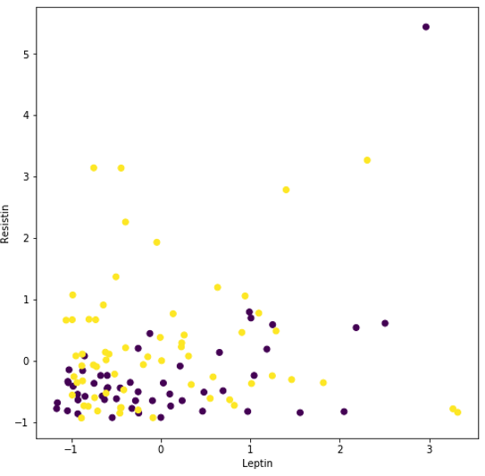
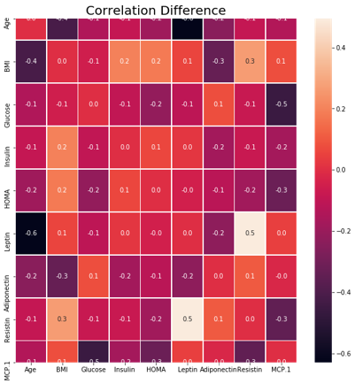
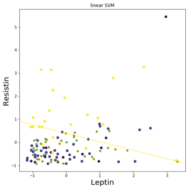
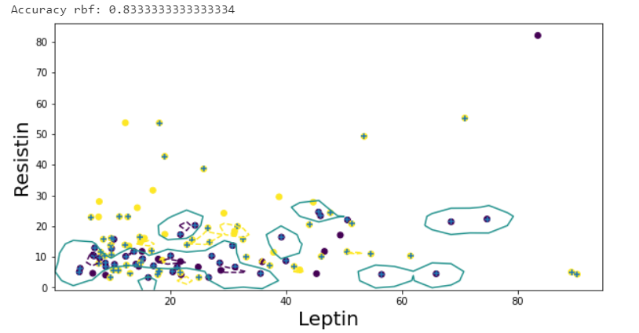
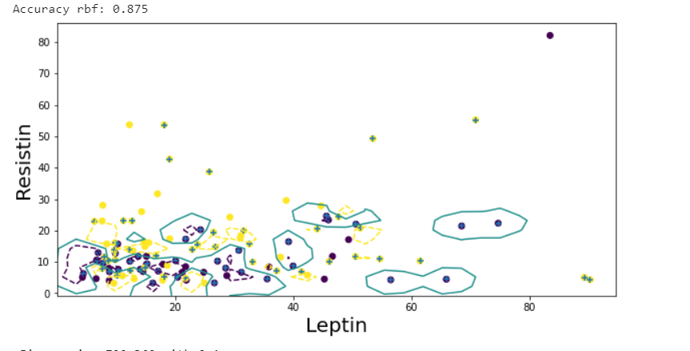

# Breast-Cancer-Classification

File 1 - Using the Wisconsin breast cancer diagnostic data set for predictive analysis

File 2 - Download the data from  https://archive.ics.uci.edu/ml/datasets/Breast+Cancer+Coimbra

1- Created a training and test set and compute the accuracy (Training data is 80%
or the dataset and Test data is 20% of the dataset )
2- Built a model using linear kernel - the accuracy on the test data is 83%.
3- Built a model using polynomial kernel and evaluated the accuracy on the test
data (80%)
4- Built a model using rbf kernal and evaluated the accuracy on the test data (87%)

Data Visualization :

Clusters:

Correlation between all predictors:

Linear SVM Boundary:

Polynomila Kernal SVM Boundary:

RBF Kernal SVM Boundaries with C=2 gamma=0.1:

RBF Kernal SVM Boundaries with C=40 gamma=0.1:

